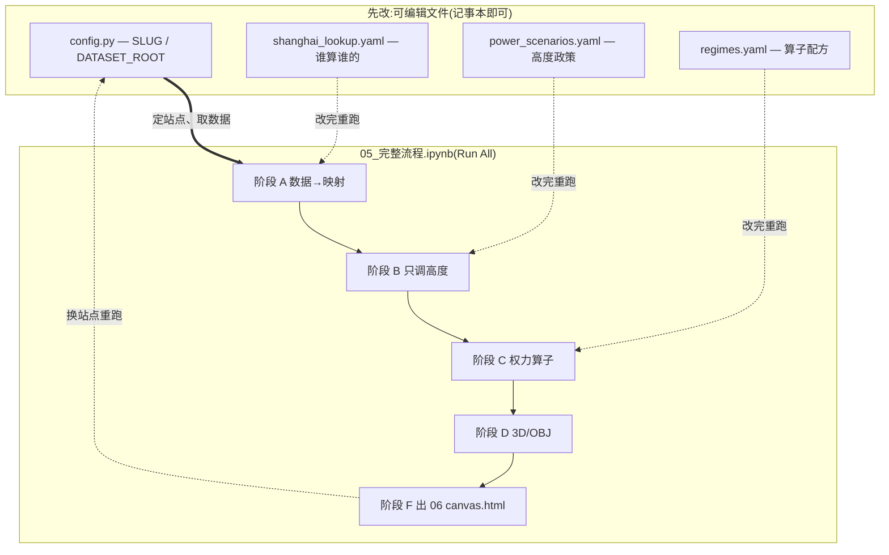

# 速查

## 一句话
上海真实多源数据 → 贴角色 →（主册）只调高度 /（进阶）算子配方 → 看天际线 / 形态指纹。

## 1 本 notebook:`05_完整流程`(Run All)
一次跑遍整条流程,分阶段:
1. **A 数据 → 映射** —— 选/拼多源数据、离散级联查表(一栋=一个权利方)。
2. **B 只调高度** —— 锁死 footprint,4 情景横比天际线。
3. **C 权力算子** —— 9 算子 × 4 体制 → 形态指纹。
4. **D 3D / OBJ** —— 挤量体 + 导出 OBJ。
5. **F 互动 html** —— 交给 `06_AI Render Students` 出 `canvas.html`。

产物集中到 `out/<slug>/Step_05/<时间戳>/`;`RUN_ALL_SITES=1` 跑遍所有缓存街道。

## 能改的文件(就在这个文件夹,不用进 engine)
- `config.py` —— 换站点 `SLUG`(lujiazui / caoyang / yuyuan);进阶填 `DATASET_ROOT`。
- `shanghai_lookup.yaml` —— 谁算谁的。改完重跑阶段 A。
- `power_scenarios.yaml` —— 高度政策。改完重跑阶段 B。
- `regimes.yaml` —— 算子配方。改完重跑阶段 C。
- 加算子:`算子替换指南.md` + `engine/my_operator.py`。

## 各阶段用到的 config / yaml
- **阶段 A 数据 → 映射** —— `config.SLUG` + `config.DATASET_ROOT`(判断有没有数据集);建缓存时用 `config.SITES` / `site_name()`,写 `data/<slug>/site.yaml`;`shanghai_lookup.yaml` 定「谁算谁的」(读规则 / 反事实内存改判 / `assign_all` 套用)。
- **阶段 B 只调高度**(`power_scenarios.yaml` 主场) —— `power_scenarios.yaml` 定情景,`scenario_heights` 只调高度。
- **阶段 C 权力算子**(`regimes.yaml` 主场) —— `regimes.yaml` 配方(9 算子 × 4 体制);间接读 `data/<slug>/site.yaml`(算容积率/覆盖率要街道面积)。
- **阶段 D / F** —— 挤 OBJ 到 `out/<slug>/`;把体块交给 `06` 出 `canvas.html`。

对应:`config.py`→A · `shanghai_lookup.yaml`→A · `power_scenarios.yaml`→B · `regimes.yaml`→C。
开头 `import config` 只为清模块缓存 + 取 `SLUG`,不改区块。

## 依赖关系(先改 → 后跑)
- 图例:粗线=数据来源 · 细线=执行顺序 · 虚线=改文件后要重跑那本。

- 数据流(每本内部同一条链):`config.SLUG` → `data/<slug>/buildings.parquet` → `assign_all`(读 `shanghai_lookup.yaml`)→ `scenario_heights`(读 `power_scenarios.yaml`)/ `apply_regime`(读 `regimes.yaml`)。
- 先后铁律:先定 `config.SLUG`(01 建/取数据),才有楼可贴角色(02);先贴角色,才能只调高度(03)与套算子配方(04)。

## power_scenarios.yaml 三个值
- `mult`:高度权重。>1 长高,<1 压低。
- `cap_m`:高度上限(米)。
- `_mode`:`conserve` 总量守恒、只重分配 / `grow` 只增不减。

## 9 个原子算子(进阶)
`freeze` 锁定 · `weight_height` 按权重重分配高度 · `concentrate` 向权力重心收拢 ·
`split_to_towers` 拆板成塔 · `slim` 塔化 · `densify` 加密 · `infill` 居民自建细分 ·
`level` 平权趋同 · `open_ground` 释放共享地面。**权力体制 = 这些动词的配方。**

## 四种权力 → 四种形态指纹
- 开发商主导 = 细针塔(瘦长比飙升)
- 政府主导/集权 = 向权力重心收拢的肥峰(重心集中度翻倍)
- 居民自建 = 细粒碎化(栋数大增)
- 共享平权 = 均质开放(高度 CV 最低)

## 五个角色(+ informal 恒空)
- `state` 政府/公共 · `developer` 开发商/资本 · `resident` 居民 ·
- `unknown` 无用途 join · `informal` 本数据无信号 → 恒为空(不硬猜)。

## 固定不变
- 建筑占地 footprint（主册）· 角色标签 · 方向单向:由权力推导形态。

## 产物在哪
- `out/<slug>/Step_05/<时间戳>/`:图 PNG、3D OBJ。
- `06_AI Render Students/out/<slug>/canvas.html`:互动 3D(浏览器直接开)。
- `data/<slug>/`:缓存(随包 3 站;自己建的也存这)。

## 边界
- 高度 AI 实测、极超高层可能低估 · EULUC 面级优先 · danwei 看不见(算居民)·
  informal 恒空 · 进阶算子是教学假设 · 教学练习,非产权认定或规划预测。
